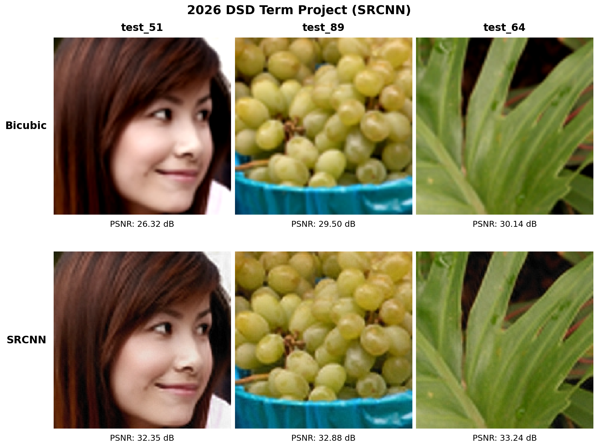

# Digital System Design

## 프로젝트 개요

한 학기 동안 FPGA/Vivado 기반 RTL 설계와 하드웨어 가속기 구조를 학습한 저장소입니다. Lab01부터 Lab07까지 연산 블록, FPGA 메모리, convolution datapath, controller를 단계적으로 구현하고, 최종 프로젝트에서 KV260용 Q8.8 SRCNN 가속기 3종을 완성했습니다.

## 한 학기 학습 과정

| Lab | 주요 내용 |
| --- | --- |
| Lab01 | Vivado 프로젝트, VIO/ILA, 기본 RTL |
| Lab02 | MAC, fixed-point adder tree, pipeline |
| Lab03 | BRAM 기반 MAC datapath |
| Lab04 | URAM/LUTRAM 기반 GEMV |
| Lab05 | PE 기반 1D multi-channel convolution |
| Lab06 | Line buffer 기반 2D convolution |
| Lab07 | Controller FSM과 memory-integrated convolution top |

```text
MAC / Adder Tree → FPGA Memory → Line Buffer / PE
→ Multi-channel Convolution → Controller FSM → SRCNN Accelerator
```

## Term Project: SRCNN Accelerator

150x150 Y-channel 이미지 3장에 3-layer SRCNN inference를 수행하는 signed 16-bit Q8.8 RTL accelerator를 설계했습니다.

| 항목 | 내용 |
| --- | --- |
| FPGA | AMD Kria KV260 / XCK26 |
| 개발 환경 | Vivado 2023.1, XSIM |
| 연산 | 3x3 Conv2D + Bias, Zero Padding, ReLU |
| 검증 | C++ fixed-point reference와 bit-level 비교 |
| 목표 주파수 | 100 MHz |

과제에서 Zynq PS, Vitis firmware, AXI/URAM 및 Python demo 환경이 제공되었으며, 팀은 동일한 interface를 따르는 **SRCNN IP 3종과 RTL testbench**를 직접 구현했습니다.

### 아키텍처 비교

| 모델 | Channel | 구조 | 핵심 설계 |
| --- | --- | --- | --- |
| SRCNN-42 | `1 → 4 → 2 → 1` | Recursive | Shared datapath와 2-pixel horizontal parallelism |
| SRCNN-88 | `1 → 8 → 8 → 1` | Recursive | Layer 2의 64-PE channel-wise parallelism |
| SRCNN-84 | `1 → 8 → 4 → 1` | Streamline | Layer별 PE/line buffer와 stage overlap |

주요 최적화는 scan-window line buffer, packed activation memory, Q8.8 post-processing, PE pipeline 조정, streamline padding insertion입니다.

## 검증 및 결과

- 세 아키텍처의 Layer 1, Layer 2, final output을 C++ reference와 비교하여 **zero mismatch**를 확인했습니다.
- Self-checking testbench로 output address/count와 이미지별 completion 신호를 검증했습니다.
- 세 구현 모두 XCK26 post-route에서 **100 MHz timing constraint**를 만족했습니다.
- 제공된 PS/Vitis demo 환경에 IP를 통합하여 실제 FPGA 출력과 PSNR 향상을 확인했습니다.

### Latency

100 MHz에서 `i_start`부터 세 번째 이미지의 최종 완료까지 측정한 결과입니다.

| 모델 | Latency | 실행 시간 |
| --- | ---: | ---: |
| SRCNN-42 | 275,459 cycles | 2.755 ms |
| SRCNN-88 | 413,183 cycles | 4.132 ms |
| SRCNN-84 | 70,297 cycles | 0.703 ms |

### FPGA Resource

| 모델 | CLB LUT | BRAM Tile | DSP | WNS |
| --- | ---: | ---: | ---: | ---: |
| SRCNN-42 | 57,820 (49.37%) | 73 (50.69%) | 145 (11.62%) | +0.589 ns |
| SRCNN-88 | 104,335 (89.08%) | 112 (77.78%) | 577 (46.23%) | +2.012 ns |
| SRCNN-84 | 40,977 (34.99%) | 33 (22.92%) | 397 (31.81%) | +1.968 ns |

### FPGA Demo



`test_51`, `test_89`, `test_64`에서 SRCNN 적용 후 Y-channel PSNR이 각각 **+6.03 dB, +3.38 dB, +3.10 dB** 향상되었습니다.

## 저장소 구성

```text
Digital_System_Design/
├── Lab01 ~ Lab07/               # 주차별 RTL 실습
└── DSD26_Termproject/
    ├── 04_SRCNN_42/             # Recursive 4-2
    ├── 05_SRCNN_88/             # Recursive 8-8
    ├── 06_SRCNN_84/             # Streamline 8-4
    └── docs/                    # Proposal, report, presentation
```

`00_RTL_Skeleton`, `01_Reference_SW`, `02_Provided_Data`, demo source와 수업 가이드는 제공 자료이므로 저장소에서 제외했습니다. 각 구현 폴더에는 RTL, testbench, initialization/reference data, simulation script 및 implementation report가 포함됩니다.

## 프로젝트 문서

- [Final Report](./DSD26_Termproject/docs/DSD26_team6_report.pdf)
- [Presentation](./DSD26_Termproject/docs/DSD26_team6_presentation.pdf)
